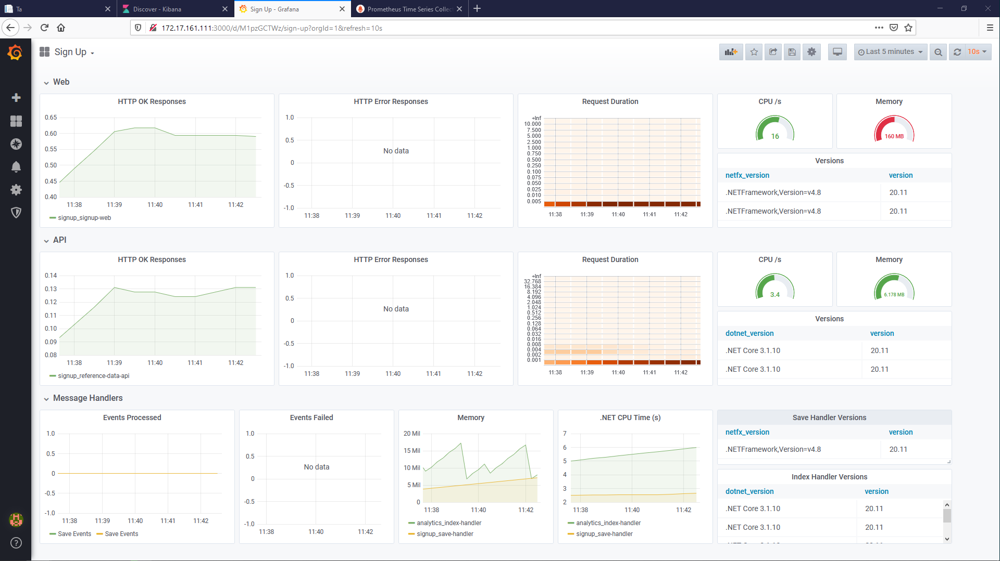

# Monitoring Dashboards

Exposing metrics endpoints from all your app containers is the first step to getting consistent monitoring.

Next you need to run two other components - a metrics server, which grabs and stores all the metrics from your containers, and a dashboard which presents the data in a usable way.

We'll do that by running [Prometheus](https://prometheus.io) and [Grafana](https://grafana.com) - the leading tools in this space. They'll run in containers alongside our app and the other infrastructure components.


## Configuring Prometheus

Prometheus is a monitoring server which collects metrics, stores them and lets you run queries through an API. We've seen how the Prometheus metrics format looks and all our application components expose metrics, so now we can run Prometheus to collect them - Prometheus calls this _scraping_.

You configure the endpoints for Prometheus to scrape in a YAML file. You can name explicit endpoints but in a production scenario you want Prometheus to find them for you, so when containers are replaced or new components are deployed you don't need to edit your configuration.

Prometheus has _service discovery_ which works with the Docker Swarm API to find all the containers running on the nodes. This is set up in [prometheus.yml](../../app/05/05-06/configs/prometheus.yml) - which looks complicated, but is completely generic so you can use the same configuration in any Swarm. 

_Create the Prometheus config object:_

```
docker config create prometheus-config app/05/05-06/configs/prometheus.yml
```

> This uses an opt-in approach - services need to set themselves as Prometheus enabled using a label, just like with Traefik.

## Configuring Grafana

Prometheus has a basic web UI for management and running queries, but it's not a full visualization solution - for that we need Grafana. Grafana runs Prometheues queries and visualizes the results.

We'll run Grafana in a container using the team's official image. That image lends itself to automation, and we'll inject configuration so the dashboard is ready to go as soon as we deploy the monitoring stack.

There are three parts to the Grafana configuration:

* [grafana-datasources.yaml](../../app/05/05-06/configs/grafana-datasources.yaml) - sets up Prometheus as a data source
* [grafana-providers.yaml](../../app/05/05-06/configs/grafana-providers.yaml) - sets the folder where the dashboards are stored
* [signup-dashboard.json](../../app/05/05-06/configs/signup-dashboard.json) - is the actual dashboard for the Sign Up app

_Deploy the Grafana config objects:_

```
docker config create grafana-datasources app/05/05-06/configs/grafana-datasources.yaml

docker config create grafana-providers app/05/05-06/configs/grafana-providers.yaml

docker config create signup-dashboard app/05/05-06/configs/signup-dashboard.json
```

## Running Prometheus and Grafana

The monitoring stack can be a shared component in the cluster. All applications can use the same monitoring components, as with the logging subsystem.

Prometheus and Grafana are modelled in [metrics.yaml](../../app/05/05-06/metrics.yaml). There's nothing specific to the Sign Up application here except the networks which Prometheus attaches too - we could use a dedicated monitoring network instead and connect the app containers to that.

_Deploy the monitoring stack:_

```
docker stack deploy -c app/05/05-06/metrics.yaml metrics

docker stack ps metrics
```

> Browse to port `9090` on any node to see the Prometheus web UI. Browse to _Status...Service Discovery_ to see what Prometheus has discovered from the Swarm, and _Status...Targets_ to see there are no targets yet.

## Update the Sign Up app to enable metrics

There are two changes we need to make to the application components: the app configuration needs to enable metrics, and the service configuration needs to opt-in to Prometheus collection.

We'll start with the index handler which is in [analytics-v4.yml](../../app/05/05-06/analytics-v4.yml). The labels contain all the details for Prometheus to find and scrape the metrics endpoint.

_Update the analytics stack:_

```
docker stack deploy -c app/05/05-06/analytics-v4.yml analytics

docker stack ps analytics -f "desired-state=running"
```

> When the new containers are running, browse back to the Prometheus UI and look at the Service Discovery tab - now the index handler service is included.

In the _Graph_ window, check on two metrics:

* `app info` - shows the runtime and application versions
* `process_cpu_seconds_total` - shows how much CPU the .NET processes are using

## Update the other application components

The metrics setup is the same for Linux and Windows containers. In [signup-v6.yml](../../app/05/05-06/signup-v6.yml) there are environment settings and labels for the other components to add them to Prometheus.

_Deploy the updates:_

```
docker stack deploy -c app/05/05-06/signup-v6.yml signup

docker stack ps signup -f "desired-state=running"
```

> When the new containers are running, use the app to add some data and then browse back to the Prometheus UI.

In the _Graph_ window, refresh the two metrics:

* `app info` - shows versions for all components
* `process_cpu_seconds_total` - shows CPU usage for all components
* `http_requests_received_total` - shows HTTP requests for the WebForms app and API
* `message_handler_events` - shows events processed by the handlers
* `prospect_saves` - shows how many prospects have been added in the app

Prometheus collects all this data from the containers and saves every metric with a timestamp, so you can run queries to show trends over time.

## Check the dashboard in Grafana

Grafana is already running with the application dashboard deployed. 

Browse to port `3000` on any node and sign in with `admin/admin` to open the Grafana UI. Skip creating a new password and in the _Home_ icon in the top-left, click the _Sign Up_ dashboard.

You'll see something like this, which shows the core details about all the application components - and shows that nothing is working very hard:




## Run some load tests

The dashboard isn't very interesting at the moment. We can generate some load to test the WebForms app and the API using [Fortio](http://fortio.org) - a simple open-source load test app.

We'll run Fortio containers to send load into the app containers using the definition in [fortio.yaml](../../app/05/05-06/fortio.yaml).

_Deploy the load test containers:_

```
docker stack deploy -c app/05/05-06/fortio.yaml fortio

docker stack ps fortio

docker service logs fortio_fortio-web
```

> Keep the Grafana dashboard open. It's set to reload every 10 seconds and you'll see the app containers start working hard.

## Other components to monitor

We've seen application monitoring here with a dashboard that shows the overall health of the app. Prometheus also provides an alerting component so you can trigger alerts on queries - automating the pager before problems get serious.

In production you would also want to collect metrics from the Docker Engine and the servers in your cluster. Prometheus supports that too, and the end goal would be to have multiple dashboards at different levels for different applications and different teams.